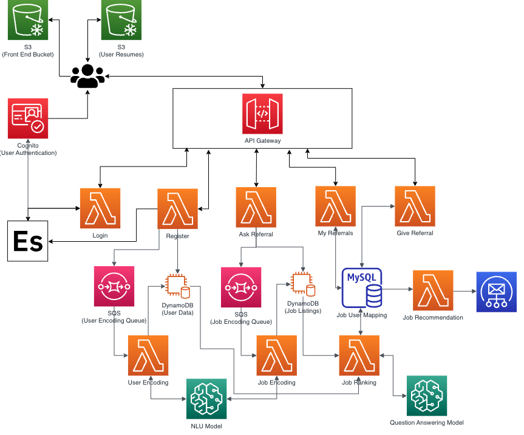
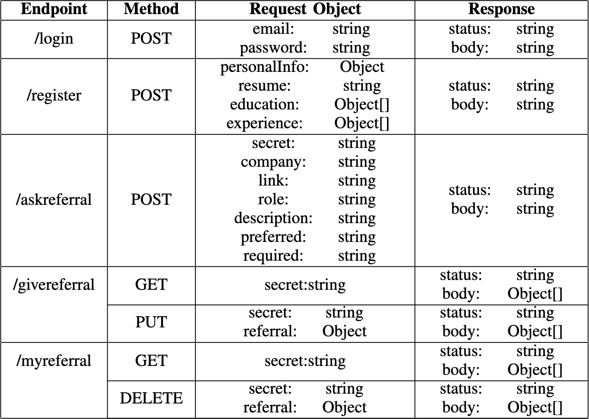

# Referral Connect Backend
This repository contains the lambda functions for the backend functioning of the Referral Connect project.

# Architecture

# Design Principles
1. Scalability
    * Don’t want long polling calls to the backend keeping the user waiting
    * Having ML & DL models in backend complicates the process
2. Flexibility
    * Don’t want to lock ourselves into an early design that would be restrictive for ML development
    * Decouple services so that we can perform operations independently
3. Simplicity
    * Complicated user flows are more detrimental than useful

# Design
## Data Sources
The data sources for the referral connect portal are encompassed in two DynamoDB tables, one MySQL relational database, and 2 Simple Queue Services. We also use a Open Search Domain to speed up lookup of user attributes that were slow to query from the database and cognito for validation purposes.  
1. **DynamoDB** - We use two DynamoDB tables to store the user and job data along with they NLU model encodings which can be fetched during ranking based on the primary key of the entity.
2. **MySQL** - We needed a relational database to host the mappings between the jobs and the users that have applied for those jobs. We also store the score of the job match to the user profile using our ranking algorithm along with the status of where the job is currently in our pipeline. There are 3 status that a applied referral can be in:
    * **Scoring** - This status means that the job is queued for storings and our pipeline is encoding either the user data, job data, or both. Once we are done encoding the entity we move on to the next stage.
    * **Queued** - This status means that the referral is ranked and we are awaiting users to see this and referral to give a referral or deny.
    * **Matched** - This status means that the referral was referred by someone in the organization and now can be removed from active list of referrals.
3. **Simple Queue Service** - SQS is used to provide the much needed asynchronous nature in the application. We use 2 SQS queues which contain the user and the job when they are added. Initially when a user is put in the database they do not have encodings. We use two Lambdas that run on schedule to get the user and the job from the SQS queue and generate encodings using the Sagemaker NLU model. Once we get the encodings we update the corresponding user or job.
4. **Open Search Service** - We don't want to query the DynamoDB which is the primary data source again and again for smaller lookups. Therefore, we store certain states for the user in the open search domain for faster lookup. These entities are the mappings from the user id which is the email to user attributes such as company name, resume link, etc.
5. **Cognito** - AWS Cognito is used for security and authentication of the application. We use this service to authorize the users that are logging into our application. This is done by creating a user pool and adding the users to the user pool and then authenticating using cognito.

## API & Lambdas

In the above table is detailed the API definitions used in the application. For the API we are passing the user secret in the request through the API and have used a Lambda proxy to return the response back to the user.  
Following are the lambdas and their function that were used in the application:  
1. **Login** - As the name states this lambda simply takes the user credential information and logs the user in through authentication using Cognito. This lambda also returns a base64 encoded secret back to the user which needs to be added to every header in subsequeunt request so as to authenticate the user as well as find the user identity in every request sent to the server.
2. **Register** - As the name states this lambda takes the registration information from the user and adds it into our database. We also add the user to the user encoding queue to create user encodings that will be used by the ranking functions at a later stage.
3. **Ask Referral** - This lambda function takes from user the job they are seeking a referral for and adds the job to the job listings database along with the job to the job encoding queue. This job encoding queue is used to create the encodings for the job at a later time to be used by the ranking function.
4. **My Referral** - This lambda function fetches the referrals that are stored corresponding to the user in the database. These are the referrals that the user is seeking and are awaiting matching, scoring or are simply queued. This lambda can also be used to delete the referral as well.
5. **Give Referral** - This lambda function is used for giving the referral to a specific job posting. The referrer can use this lambda function to update the status of a job posting in the database and provide a referral to the referral seeker.
6. **User Encoding** - This lambda function takes the users queued in the new user encoding queue and creates encodings using the NLU sagemaker endpoint. Then adds those encodings to the database so that they can be used by the ranking function.
7. **Job Encoding** - This lambda function takes the jobs queued int he job encoding queue and creates encodings using the NLU sagemaker endpoint. Then the encodings are added to the database that can b used by the ranking function at a later point in time.
8. **Job Ranking** - This lambda function takes as input a job to user mapping and matches the encodings created along with additional static checks (discussed in the below sections). Finally a score is computed based on a heuristic we have come up with and then adds that score to the database.

## Resume to Job Matching
Our target is to provide a smart score for each user to job post (that they want a referral of) which signifies how suited the user profile is to the particular job. This feature can then be used to rank the candidates based on the smart score, in case there are more than one candidate for the same job posting. 

To come up with a solution to this problem required intricate understanding of the various components of a job post as well as a user. A job posting usually contains the following information: 

* Job Link
* Job Title
* Job Description/ Roles and Responsibilities
* Basic/Required Qualifications
* Preferred Qualifications 

Similarly, for a user, we have:
* Education: level and major
* Work experiences
* Technical Skills

We store these information for each user and job post in corresponding DynamoDB for ease of use. 

Here, we use the job link as our primary key to index our jobs database as the link is unique. The roles and responsibilities of the jobs need to be compared with the work experience and skills of the user. Moreover, the education of the user needs to be greater than or equal to the education required for the job. Similarly, if the user has most of the preferred qualifications, we must give that a higher weight. We also need to check if the job requires experience and then compare that with the user. 

Abstractly, we use a ML model to compute content embeddings of each of the above mentioned subparts of both a job and the user. We then use a scoring function (such as cosine) to compute similarity between different aspects of the job and the user. We combine these scores using a custom scoring metric which is designed to increase the score of the most similar user job pair and reduce the score of the least similar pair. 

The different models that we use are:
1. We use a sentence transformer based model to compute sentence/paragraph embeddings for the text inputs for similarity based calculations 
2. We use a QA model to extract basic information from job postings such as degree required, major required, and years of experience needed. 
3. We use a trained word2vec model to compute word embeddings for similarity computation.
4. We use a heuristic based skills extraction model to extract skills from both job postings and users resume